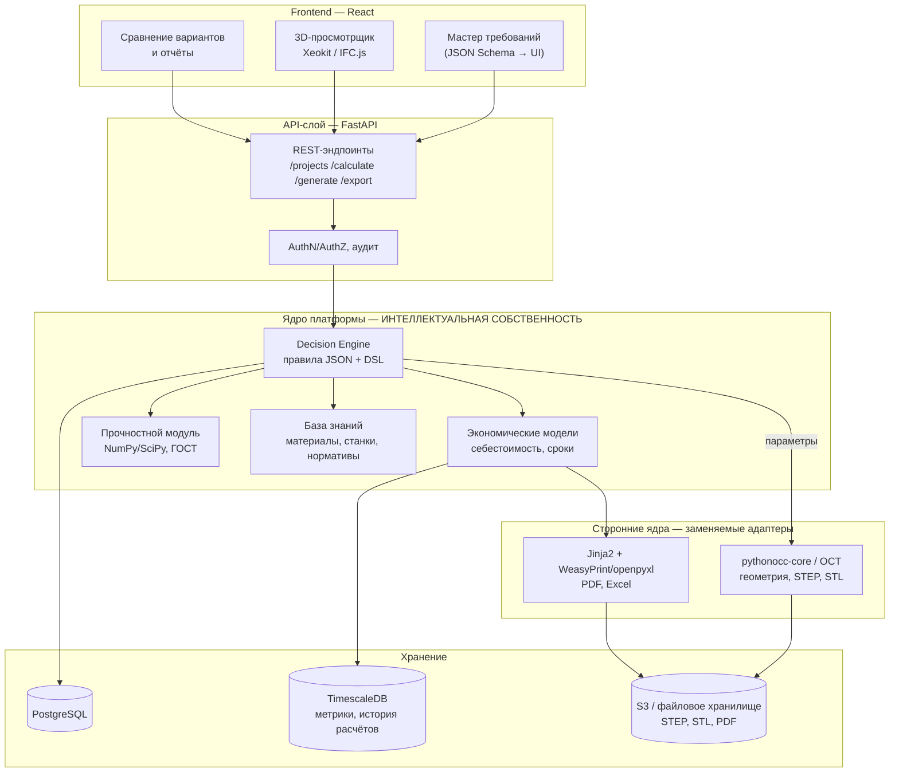

# SmartMach — Автоматизированный конструктор типовых узлов

Прототип платформы: пользователь вводит требования к узлу (корпус редуктора), система выдаёт
**3 варианта производства** (фрезеровка / литьё / 3D-печать) со сроками и себестоимостью,
параметрическую 3D-модель, отчёт (спецификация, маршрутная карта, себестоимость)
и файлы для производства (STEP, STL, PDF).

> Вспомогательная версия. Изолирована в `prototype/constructor/`, основные модули СмартМаш не затрагивает.

---

## 1. Высокоуровневая архитектура



### Текстовое описание

Платформа построена по слоистой схеме с жёсткой изоляцией собственной интеллектуальной
собственности от сторонних движков.

**Frontend (React)** — тонкий клиент. Отвечает только за ввод требований через мастер,
генерируемый из JSON Schema, отображение сравнения вариантов и просмотр 3D-модели
(Xeokit/IFC.js — исключительно просмотр, без вычислений на клиенте). Никакой бизнес-логики
на фронте нет: это защищает алгоритмы и позволяет менять UI не трогая ядро.

**API-слой (FastAPI)** — контракт системы. Валидация через Pydantic, аутентификация,
разграничение прав по предприятиям, аудит всех расчётов. Слой не содержит логики принятия
решений, только оркестрацию.

**Ядро платформы** — здесь сосредоточена вся ценность продукта и предмет защиты прав:
- *Decision Engine* — движок правил на собственном DSL поверх JSON. Правила описывают выбор
  технологии по партии, геометрии, точности, материалу и доступному парку станков.
- *Экономические модели* — расчёт себестоимости (материал, машинное время, оснастка, передел,
  накладные) и сроков подготовки производства.
- *Прочностной модуль* — упрощённые проверки по ГОСТ на NumPy/SciPy: запас прочности, зоны риска.
- *База знаний* — справочники материалов, станков, нормативов трудоёмкости.

**Сторонние ядра** подключены через адаптеры: pythonocc-core (Open Cascade) отвечает только за
построение геометрии и экспорт STEP/STL, Jinja2 с WeasyPrint/openpyxl — за рендер отчётов.
Собственное CAD-ядро не разрабатывается. Любой внешний компонент заменяем без переписывания
Decision Engine — граница проходит по интерфейсу «параметры → геометрия».

**Хранение**: PostgreSQL для проектов и правил, TimescaleDB для истории расчётов и метрик
(аналитика по срокам и экономии), объектное хранилище для выходных файлов.

**Технологический суверенитет**: все компоненты — открытые и свободно распространяемые,
без проприетарных зарубежных лицензий (Open Cascade — LGPL). Ядро принятия решений
разработано полностью самостоятельно.

---

## 2. API и сценарии использования

| Сценарий | Входные данные | Выходные данные | Эндпоинты FastAPI |
|---|---|---|---|
| Создать проект | Название, тип узла, заказчик | ID проекта, статус | `POST /api/v1/projects` |
| Задать требования | Габариты, материал, партия, точность, срок, парк станков | Валидированные требования, ID ревизии | `PUT /api/v1/projects/{id}/requirements` |
| Рассчитать варианты | ID проекта (требования) | 3 варианта: метод, срок, стоимость, риски, оснастка | `POST /api/v1/projects/{id}/calculate` |
| Сгенерировать модель | ID проекта + выбранный вариант | Параметрическая 3D-модель, проверки толщин/коллизий | `POST /api/v1/projects/{id}/generate` |
| Прочностная проверка | Геометрия + нагрузки + материал | Запас прочности, зоны риска | `POST /api/v1/projects/{id}/strength` |
| Экспортировать файлы | ID модели, форматы | Ссылки на STEP, STL, PDF | `POST /api/v1/projects/{id}/export` |
| Получить отчёт | ID проекта, тип отчёта | Спецификация, маршрутная карта, себестоимость (JSON/PDF/XLSX) | `GET /api/v1/projects/{id}/report` |
| Просмотр 3D | ID модели | Геометрия для Xeokit (glTF/XKT) | `GET /api/v1/models/{id}/viewer` |
| Управление правилами | Набор правил DSL | Версия правил, результат валидации | `GET/POST /api/v1/rules` |
| Схема мастера | Тип узла | JSON Schema для генерации формы | `GET /api/v1/schema/{unit_type}` |

---

## 2.1. CAM-модуль: плазменная и лазерная резка

Отдельный контур `app/cutting/` — 2D-технология листовой резки. В отличие от фрезеровки,
здесь инструмент имеет физическую ширину (керф), а деталь вырезается из листа.

| Эндпоинт | Назначение |
|---|---|
| `GET /api/v1/cutting/database` | Справочник источников, материалов, классов качества |
| `POST /api/v1/cutting/compare` | Сравнение плазмы и лазера: время, себестоимость, раскрой |
| `POST /api/v1/cutting/gcode` | Генерация управляющей программы под конкретный станок |

### Состав модуля

| Файл | Содержание |
|---|---|
| `cut_database.json` | Режимы: керф, подача, время пробивки, ток — по материалам и толщинам |
| `geometry2d.py` | Контуры, керф-компенсация, подводы, проверка технологичности |
| `postprocessor.py` | Генератор G-кода, 3 постпроцессора |
| `nesting.py` | Раскрой листа, коэффициент использования, экономика |

### Что решено технологически

- **Компенсация керфа.** Траектория смещается на половину ширины реза: наружу для контура,
  внутрь для отверстий. Проверено: контур 200×100 при керфе 2,4 мм даёт траекторию
  202,4×102,4 мм, отверстие ⌀30 → 27,6 мм. Без этого вся партия уходит в брак по размеру.
- **Порядок обхода.** Сначала все отверстия, затем наружный контур — иначе деталь
  отделяется от листа раньше, чем в ней прорезаны отверстия.
- **Подводы и пробивка.** Прожиг выполняется в стороне от чистовой кромки: в момент
  пробивки образуется кратер и разбрызгивание металла.
- **Интерполяция режимов.** Толщина 8 мм отсутствует в таблице → режим считается между
  6 и 10 мм: керф 2,2 мм, подача 2150 мм/мин, пробивка 0,65 с, ток 75 А.
- **Проверка технологичности.** Отверстие меньше толщины листа вырезать нельзя —
  система выдаёт ошибку и рекомендует сверление. Контролируются также узкие перемычки.

### Постпроцессоры

| Ключ | Станок | Особенности |
|---|---|---|
| `hypertherm` | Hypertherm EDGE | M07/M08, THC через M50/M51 |
| `linuxcnc` | LinuxCNC + THC | Открытый стек, подходит для отечественной сборки |
| `laser` | Волоконный лазер | Управление мощностью, газ, ступенчатая пробивка на толстом листе |

Добавление нового станка — это новый класс на ~20 строк, траектория не пересчитывается.

### Проверенный результат

Фланец 300×200 с 5 отверстиями (20 шт) + косынка 150×150 (40 шт), Ст3 8 мм, лист 1500×3000:

| Источник | Себестоимость | Время | Керф |
|---|---|---|---|
| Плазма воздушная | 393 ₽/шт | 41 мин | 2,20 мм |
| Плазма HD | 408 ₽/шт | 43 мин | 1,63 мм |
| Волоконный лазер | 410 ₽/шт | 44 мин | 0,24 мм |

Раскрой: 60 деталей на 1 листе, использование металла 46,7%.
Программа для Hypertherm: 307 строк, 6 пробивок, 1413 мм реза.

### Ограничения CAM-модуля

- Раскрой по габаритным прямоугольникам (shelf-алгоритм). True shape nesting по реальному
  контуру даст +15–25% использования металла — следующий этап.
- Керф-компенсация корректна для выпуклых и слабовогнутых контуров. Для сложных форм
  с самопересечениями нужен полноценный clipper (pyclipper) — интерфейс не изменится.
- Дуги выгружаются полилинией (G1). Поддержка G2/G3 сократит объём программы в разы.
- Режимы ориентировочные и требуют калибровки под конкретный источник и станок.

---

## 3. Установка и запуск

```bash
cd prototype/constructor

# Вариант A — Docker (рекомендуется: pythonocc ставится через conda)
docker build -t smartmach-constructor .
docker run -p 8000:8000 smartmach-constructor

# Вариант B — локально (Decision Engine и отчёты работают без OCC)
pip install -r requirements.txt
uvicorn app.main:app --reload --port 8000
```

Документация API: http://localhost:8000/docs

Быстрая проверка:

```bash
curl -X POST http://localhost:8000/api/v1/calculate \
  -H "Content-Type: application/json" \
  -d @examples/input_gearbox.json
```

> `pythonocc-core` недоступен через pip. Без него модуль геометрии работает в режиме заглушки
> (расчёт массы и объёма аналитически), Decision Engine и отчёты функционируют полностью.

---

## 4. Дорожная карта, 6 месяцев

| Этап | Цель | Результат | Срок | Измеримый эффект | Грант / коммерциализация |
|---|---|---|---|---|---|
| 1. MVP | Корпус редуктора: расчёт вариантов, модель, отчёт | Работающий прототип, 3 варианта, экспорт STEP/STL/PDF | Мес. 1–2 | Сокращение подготовки производства на 30% | Демо для заявки в «Сколково», пилот с 1–2 заводами |
| 2. Расширение узлов | Библиотека типовых узлов | Валы, фланцы, кронштейны, крышки (+5 типов) | Мес. 3 | Покрытие до 60% типовой номенклатуры | Региональная программа Самарской обл., платная подписка |
| 3. Прочность и нормативы | Расчёты по ГОСТ | Модуль проверок, отчёт с зонами риска | Мес. 4 | Снижение брака проектирования на 20% | Подтверждение технологического суверенитета |
| 4. CAM-слой | Технологическая подготовка | Маршрутные карты, нормирование, базовый G-код 3 оси | Мес. 5 | Сокращение сроков ТПП до 50% | Апсейл модуля CAM |
| 5. Интеграции ERP | Встраивание в контур предприятия | Коннекторы 1С:ERP, обмен спецификациями | Мес. 6 | Исключение ручного переноса данных | Корпоративные лицензии |
| 6. Обучение | Модуль на «Учисьпро.рф» | Курс работы с платформой, сертификация | Мес. 5–6 | Ускорение внедрения в 2 раза | Доп. выручка на обучении, требование грантов по кадрам |

---

## 5. Риски и ограничения

| Риск | Влияние | Минимизация |
|---|---|---|
| Точность упрощённых расчётов | Ошибка оценки прочности | Позиционировать как предварительную оценку; верификация FEM; обязательное согласование конструктором |
| Погрешность себестоимости | Неверные коммерческие решения | Калибровка по фактическим данным предприятия; вилка «оптимистично–пессимистично»; версионирование моделей |
| Совместимость STEP/STL | Проблемы импорта в CAD заказчика | STEP AP214/AP242, автотесты импорта в КОМПАС/NX; валидация геометрии перед выдачей |
| Ограничения Open Cascade | Сложные поверхности | Ограничить номенклатуру типовыми узлами; отсекать нетиповые случаи на входе |
| Безопасность данных (КД — коммерческая тайна) | Утечка конструкторской документации | On-premise поставка, шифрование при хранении и передаче, RBAC, полный аудит, изоляция по тенантам |
| Зависимость от внешних библиотек | Санкционные и лицензионные риски | Только открытые лицензии (LGPL/MIT), зеркалирование репозиториев, адаптеры для быстрой замены |
| Сопротивление персонала | Медленное внедрение | Модуль обучения на «Учисьпро.рф», понятный мастер требований, пилот на реальной детали |