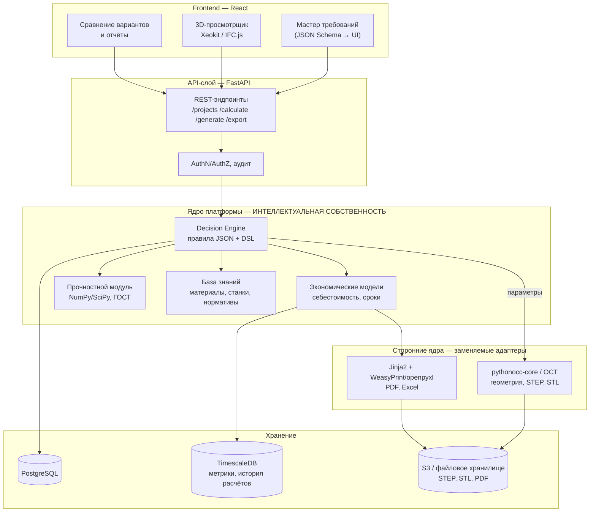

# SmartMach — Автоматизированный конструктор типовых узлов

Прототип платформы: пользователь вводит требования к узлу (корпус редуктора), система выдаёт
**3 варианта производства** (фрезеровка / литьё / 3D-печать) со сроками и себестоимостью,
параметрическую 3D-модель, отчёт (спецификация, маршрутная карта, себестоимость)
и файлы для производства (STEP, STL, PDF).

> Вспомогательная версия. Изолирована в `prototype/constructor/`, основные модули СмартМаш не затрагивает.

---

## 1. Высокоуровневая архитектура



### Текстовое описание

Платформа построена по слоистой схеме с жёсткой изоляцией собственной интеллектуальной
собственности от сторонних движков.

**Frontend (React)** — тонкий клиент. Отвечает только за ввод требований через мастер,
генерируемый из JSON Schema, отображение сравнения вариантов и просмотр 3D-модели
(Xeokit/IFC.js — исключительно просмотр, без вычислений на клиенте). Никакой бизнес-логики
на фронте нет: это защищает алгоритмы и позволяет менять UI не трогая ядро.

**API-слой (FastAPI)** — контракт системы. Валидация через Pydantic, аутентификация,
разграничение прав по предприятиям, аудит всех расчётов. Слой не содержит логики принятия
решений, только оркестрацию.

**Ядро платформы** — здесь сосредоточена вся ценность продукта и предмет защиты прав:
- *Decision Engine* — движок правил на собственном DSL поверх JSON. Правила описывают выбор
  технологии по партии, геометрии, точности, материалу и доступному парку станков.
- *Экономические модели* — расчёт себестоимости (материал, машинное время, оснастка, передел,
  накладные) и сроков подготовки производства.
- *Прочностной модуль* — упрощённые проверки по ГОСТ на NumPy/SciPy: запас прочности, зоны риска.
- *База знаний* — справочники материалов, станков, нормативов трудоёмкости.

**Сторонние ядра** подключены через адаптеры: pythonocc-core (Open Cascade) отвечает только за
построение геометрии и экспорт STEP/STL, Jinja2 с WeasyPrint/openpyxl — за рендер отчётов.
Собственное CAD-ядро не разрабатывается. Любой внешний компонент заменяем без переписывания
Decision Engine — граница проходит по интерфейсу «параметры → геометрия».

**Хранение**: PostgreSQL для проектов и правил, TimescaleDB для истории расчётов и метрик
(аналитика по срокам и экономии), объектное хранилище для выходных файлов.

**Технологический суверенитет**: все компоненты — открытые и свободно распространяемые,
без проприетарных зарубежных лицензий (Open Cascade — LGPL). Ядро принятия решений
разработано полностью самостоятельно.

---

## 2. API и сценарии использования

| Сценарий | Входные данные | Выходные данные | Эндпоинты FastAPI |
|---|---|---|---|
| Создать проект | Название, тип узла, заказчик | ID проекта, статус | `POST /api/v1/projects` |
| Задать требования | Габариты, материал, партия, точность, срок, парк станков | Валидированные требования, ID ревизии | `PUT /api/v1/projects/{id}/requirements` |
| Рассчитать варианты | ID проекта (требования) | 3 варианта: метод, срок, стоимость, риски, оснастка | `POST /api/v1/projects/{id}/calculate` |
| Сгенерировать модель | ID проекта + выбранный вариант | Параметрическая 3D-модель, проверки толщин/коллизий | `POST /api/v1/projects/{id}/generate` |
| Прочностная проверка | Геометрия + нагрузки + материал | Запас прочности, зоны риска | `POST /api/v1/projects/{id}/strength` |
| Экспортировать файлы | ID модели, форматы | Ссылки на STEP, STL, PDF | `POST /api/v1/projects/{id}/export` |
| Получить отчёт | ID проекта, тип отчёта | Спецификация, маршрутная карта, себестоимость (JSON/PDF/XLSX) | `GET /api/v1/projects/{id}/report` |
| Просмотр 3D | ID модели | Геометрия для Xeokit (glTF/XKT) | `GET /api/v1/models/{id}/viewer` |
| Управление правилами | Набор правил DSL | Версия правил, результат валидации | `GET/POST /api/v1/rules` |
| Схема мастера | Тип узла | JSON Schema для генерации формы | `GET /api/v1/schema/{unit_type}` |

---

## 2.1. CAM-модуль: плазменная и лазерная резка

Отдельный контур `app/cutting/` — 2D-технология листовой резки. В отличие от фрезеровки,
здесь инструмент имеет физическую ширину (керф), а деталь вырезается из листа.

| Эндпоинт | Назначение |
|---|---|
| `GET /api/v1/cutting/database` | Справочник источников, материалов, классов качества |
| `POST /api/v1/cutting/compare` | Сравнение плазмы и лазера: время, себестоимость, раскрой |
| `POST /api/v1/cutting/gcode` | Генерация управляющей программы под конкретный станок |

### Состав модуля

| Файл | Содержание |
|---|---|
| `cut_database.json` | Режимы: керф, подача, время пробивки, ток — по материалам и толщинам |
| `geometry2d.py` | Контуры, керф-компенсация, подводы, проверка технологичности |
| `postprocessor.py` | Генератор G-кода, 3 постпроцессора |
| `nesting.py` | Раскрой листа, коэффициент использования, экономика |

### Что решено технологически

- **Компенсация керфа.** Траектория смещается на половину ширины реза: наружу для контура,
  внутрь для отверстий. Проверено: контур 200×100 при керфе 2,4 мм даёт траекторию
  202,4×102,4 мм, отверстие ⌀30 → 27,6 мм. Без этого вся партия уходит в брак по размеру.
- **Порядок обхода.** Сначала все отверстия, затем наружный контур — иначе деталь
  отделяется от листа раньше, чем в ней прорезаны отверстия.
- **Подводы и пробивка.** Прожиг выполняется в стороне от чистовой кромки: в момент
  пробивки образуется кратер и разбрызгивание металла.
- **Интерполяция режимов.** Толщина 8 мм отсутствует в таблице → режим считается между
  6 и 10 мм: керф 2,2 мм, подача 2150 мм/мин, пробивка 0,65 с, ток 75 А.
- **Проверка технологичности.** Отверстие меньше толщины листа вырезать нельзя —
  система выдаёт ошибку и рекомендует сверление. Контролируются также узкие перемычки.

### Постпроцессоры

| Ключ | Станок | Особенности |
|---|---|---|
| `hypertherm` | Hypertherm EDGE | M07/M08, THC через M50/M51 |
| `linuxcnc` | LinuxCNC + THC | Открытый стек, подходит для отечественной сборки |
| `laser` | Волоконный лазер | Управление мощностью, газ, ступенчатая пробивка на толстом листе |

Добавление нового станка — это новый класс на ~20 строк, траектория не пересчитывается.

### Проверенный результат

Фланец 300×200 с 5 отверстиями (20 шт) + косынка 150×150 (40 шт), Ст3 8 мм, лист 1500×3000:

| Источник | Себестоимость | Время | Керф |
|---|---|---|---|
| Плазма воздушная | 393 ₽/шт | 41 мин | 2,20 мм |
| Плазма HD | 408 ₽/шт | 43 мин | 1,63 мм |
| Волоконный лазер | 410 ₽/шт | 44 мин | 0,24 мм |

Раскрой: 60 деталей на 1 листе, использование металла 46,7%.
Программа для Hypertherm: 307 строк, 6 пробивок, 1413 мм реза.

### Ограничения CAM-модуля

- Раскрой по габаритным прямоугольникам (shelf-алгоритм). True shape nesting по реальному
  контуру даст +15–25% использования металла — следующий этап.
- Керф-компенсация корректна для выпуклых и слабовогнутых контуров. Для сложных форм
  с самопересечениями нужен полноценный clipper (pyclipper) — интерфейс не изменится.
- Дуги выгружаются полилинией (G1). Поддержка G2/G3 сократит объём программы в разы.
- Режимы ориентировочные и требуют калибровки под конкретный источник и станок.

---

## 2.2. Адаптивное управление гибридным процессом (задел под ФСИ «Старт-Станкостроение»)

Модуль `app/hybrid/` — программный комплекс адаптивного управления гибридным
лазерно-плазменным процессом. Это софтовая часть, не требующая разработки железа:
работает поверх существующего станочного парка предприятия.

| Эндпоинт | Назначение |
|---|---|
| `GET /api/v1/hybrid/processes` | Каталог процессов, правил и сигнатур нестабильности |
| `POST /api/v1/hybrid/mode` | Подбор стартового режима по условиям на рабочем месте |
| `POST /api/v1/hybrid/monitor` | Детекция нестабильности и безопасная автокоррекция |

### Три блока, соответствующие заявленной новизне

**1. Подбор стартового режима.** 10 технологических правил вида «если… то…».
Пример для алюминия АМг6 6 мм с зазором 0,8 мм и окисленной поверхностью:

| Правило | Параметр | Изменение | Обоснование |
|---|---|---|---|
| SR-01 | Ток плазмы | +15% | Катодная очистка Al₂O₃ (Тпл 2050 °C против 660 °C у металла) |
| SR-02 | Мощность лазера | +10% | Теплопроводность Al в 4 раза выше стали |
| SR-03 | Скорость | −15% | Увеличенный зазор требует большего объёма расплава |
| SR-04 | Ток плазмы | +8% | Компенсация потерь на разрушение окисной плёнки |

Технолог получает обоснованную точку входа вместо подбора «на глаз».

**2. Детекция нестабильности.** Признаки считаются по осциллограммам тока,
напряжения и мощности. Проверено на синтетических сигналах — распознаны все
4 состояния без ложных срабатываний:

| Сигнал | Индекс стабильности | Статус | Распознано |
|---|---|---|---|
| Стабильный | 100 | stable | — |
| Блуждание дуги | 75 | warning | arc_wander |
| Двойное дугообразование | 35 | unstable | double_arcing + потеря проплавления |
| Дрейф мощности | 88 | stable | power_drift |

Ключевое техническое решение — **пик-фактор** (отношение максимального отклонения
к СКО). Блуждание дуги и двойное дугообразование дают схожий разброс тока, но
у равномерного шума пик-фактор ≈ 3–4, у одиночных выбросов — выше 6. Без этого
признака система путает два дефекта с разными причинами и выдаёт неверную коррекцию.

**3. Безопасная автокоррекция.** Два уровня защиты, критичные для внедрения в цехе:
- шаг коррекции ограничен 10% за раз — исключает разгон системы;
- критические события (двойная дуга) не применяются автоматически, а ставятся
  в очередь на подтверждение оператора — защита оборудования от прогара сопла.

Проверено: при двойном дугообразовании снижение скорости применено автоматически,
а снижение тока со 126,5 до 113,9 А поставлено в ожидание оператора.

### Метрики для заявки

| Показатель | База (ручной подбор) | Цель с комплексом |
|---|---|---|
| Время подбора режима | 2–4 ч | 30–60 мин (−70–80%) |
| Число пробных проходов | 3–5 | 1–2 (−60–70%) |
| Доля стабильных проходов | — | ≥ 85–90% |
| Доля брака | 10–15% | −10–15 п.п. |
| Расход электродов и газа | — | −15–20% |

Индекс стабильности (0–100) — измеримый показатель для протоколов пилотных испытаний.

### Проверка без доступа к установке

Генератор синтетических осциллограмм (`synth_signal`) позволяет верифицировать
алгоритмы до выхода на пилот и демонстрировать работу комплекса на защите заявки:

```bash
curl -X POST http://localhost:8000/api/v1/hybrid/monitor \
  -H "Content-Type: application/json" \
  -d '{"conditions":{"process_id":"weld_al_6"},"demo_signal":"double_arcing"}'
```

### Панель оператора

Веб-интерфейс доступен по адресу `/hybrid-control`. Работает автономно —
логика продублирована на TypeScript (`src/lib/hybridControl.ts`), поэтому демонстрация
на защите заявки не требует ни развёрнутого бэкенда, ни доступа к установке.

Прямые ссылки на сценарии для показа комиссии:

| Ссылка | Что демонстрирует |
|---|---|
| `/hybrid-control` | Стабильный процесс, индекс 100 |
| `/hybrid-control?signal=arc_wander` | Блуждание дуги, автокоррекция зазора луч–дуга |
| `/hybrid-control?signal=double_arcing` | Авария: 3 дефекта, индекс 10, блокировка коррекции |
| `/hybrid-control?signal=power_drift` | Дрейф мощности лазера |
| `/hybrid-control?process=cut_steel_10` | Резка Ст3 10 мм: кромка и экономика |
| `/hybrid-control?process=cut_steel_6` | Резка Ст3 6 мм |
| `/hybrid-control?process=cut_steel_12` | Резка Ст3 12 мм |
| `/architecture` | Схема архитектуры: приложение к заявке |

Проверенный сценарий аварии (двойное дугообразование): система распознала три
взаимосвязанных дефекта — блуждание дуги, двойное дугообразование и потерю
проплавления, снизила индекс стабильности до 10, применила безопасные коррекции
(зазор −10%, скорость −10%) и **заблокировала** снижение тока со 136,6 до 123,0 А
до подтверждения оператора.

### Специализация: резка углеродистой стали 6–12 мм

Целевой сегмент — самый массовый в металлоконструкциях. Модуль `src/lib/steelCutting.ts`
закрывает две задачи, которых нет в общем контуре управления и которые составляют
основную боль технолога.

**1. Прогноз грата и окалины.** Система показывает не факт брака, а его вероятную
причину и конкретное действие. Диагностируются шесть типов дефектов кромки:

| Дефект | Условие возникновения | Рекомендация |
|---|---|---|
| Грат по скорости | Скорость выше оптимальной для толщины | Снизить до расчётного значения |
| Грат по газу | Расход ниже нормативного | Поднять до нормы для толщины |
| Окалина | Погонная энергия выше нормы | Снизить ток либо ускорить |
| Непрорез | Высокая скорость при малой энергии | Снизить скорость, поднять мощность |
| Конусность | Фокус смещён от оптимума | Установить расчётное смещение |
| Шероховатость | Разброс тока свыше 4 % | Устранить нестабильность дуги |

**2. Учёт газа, расходников и себестоимости метра реза.** Считаются расход газа,
износ сопла в долях ресурса, машинное время, оплата оператора и потери от брака.
Ключевая метрика — себестоимость метра погонного.

#### Проверенный сценарий

Ст3 10 мм, задание 250 м реза, 60 пробивок. Цех гонит скорость (2500 вместо 1900 мм/мин)
и экономит газ (17 вместо 22 л/мин) — типичная ситуация:

| Проход | Скорость | Газ | Индекс кромки | Ожидаемый брак |
|---|---|---|---|---|
| Исходный режим | 2500 | 17,0 | 11 | 14,8 % |
| После 1-й коррекции | 2250 | 18,7 | 63 | 7,3 % |
| После 2-й коррекции | 2025 | 20,6 | 100 | 2,0 % |

Результат: **2 коррекции вместо 3–5 пробных проходов**, себестоимость метра
53 → 29 ₽ (−45,5 %), доля брака −10 п.п.

#### Соответствие целевым показателям заявки

| Показатель ФСИ | Цель | Достигнуто в расчёте |
|---|---|---|
| Сокращение пробных проходов | −60–70 % | 2 коррекции вместо 3–5 |
| Снижение доли брака | −10–15 п.п. | −10 п.п. |
| Себестоимость метра реза | — | −45,5 % |

#### Важное ограничение честности расчёта

Экономия по газу возникает не всегда. Если режим замедляется ради качества кромки,
удельный расход газа растёт — система прямо сообщает об этом и показывает, что
затраты перекрываются снижением потерь от брака. В протоколе при отрицательном
итоге блок «Эффект» оформляется как предупреждение, а не как достижение: выдавать
убыток за эффект в отчётном документе недопустимо.

#### Калибровка

Оптимальная скорость и номинальная мощность рассчитываются интерполяцией по
опорным точкам технологической базы (6 мм — 2800 мм/мин, 10 мм — 1900, 12 мм — 1450).
Степенная аппроксимация давала расхождение до 30 % на тонком листе и создавала
ложные срабатывания уже на штатном режиме. После калибровки стартовые режимы всех
толщин ряда 6/8/10/12 мм дают индекс кромки 100 без ложных дефектов.

### Схема архитектуры для заявки

Страница `/architecture` — готовое приложение к заявке на грант. Содержит
пять разделов: уровни комплекса, поток данных при резке стали, таблицу
программных интерфейсов, достигнутые показатели и связь с проектами заявителя.

Страница рассчитана на два применения: скриншот в документы и печать
через браузер (кнопка «Печать или сохранение в PDF»). Вёрстка проверена
в ширину A4 — содержимое не обрезается по краям.

**Обнаруженный и устранённый дефект печати.** В проекте уже существовало
правило `@media print`, которое скрывало всё содержимое `body` ради печати
BOM-спецификации. Оно действовало глобально, поэтому любая другая страница
уходила на печать пустым листом. Правило ограничено через `body:has(.bom-print)`:
теперь скрытие включается только там, где спецификация действительно есть.

Дополнительно для документов заданы: формат A4 с полями 12/10 мм, сохранение
цветных плашек при печати (`print-color-adjust: exact`) и запрет разрыва
разделов и таблиц между листами.

### Слой интеграции: REST API, ЧПУ, CAM

Программный комплекс встраивается в существующую экосистему предприятия:
CAM-система, стойка ЧПУ, MES и 1С. Реализованы четыре транспорта связи
с оборудованием и REST API для внешних систем.

#### Транспорты связи с оборудованием

Все адаптеры реализуют единый интерфейс `MachineAdapter`, поэтому замена
транспорта не затрагивает алгоритмы управления.

| Транспорт | Назначение | Драйвер |
|---|---|---|
| OPC UA | Современные стойки: Siemens, Fanuc, Heidenhain | asyncua |
| Modbus TCP | Старое оборудование через модули ввода-вывода | pymodbus |
| MQTT | IoT-датчики, распределённая схема | paho-mqtt |
| Симулятор | Полный контур без доступа к цеху | — |

**Принципиальное решение по зависимостям.** Драйверы промышленных протоколов —
тяжёлые пакеты, которых может не быть в окружении. Каждый адаптер импортирует
свой драйвер лениво: при отсутствии пакета транспорт штатно сообщает
о недоступности, а сервис и остальные транспорты продолжают работать.
Это позволяет демонстрировать комплекс на любом ноутбуке и разворачивать
промышленные драйверы только на шлюзе.

#### REST API

| Метод | Эндпоинт | Назначение |
|---|---|---|
| POST | `/api/v1/recommend` | Подбор режима по материалу, толщине, требованию к кромке |
| POST | `/api/v1/stability` | Детекция нестабильности и прогноз качества кромки |
| POST | `/api/v1/cam/augment` | Привязка режимов к сегментам траектории |
| POST | `/api/v1/cost` | Себестоимость задания и сходимость режима |
| GET | `/api/v1/events` | Журнал событий и производственные метрики |
| GET | `/api/v1/events/export` | Выгрузка журнала в CSV для MES и 1С |
| GET | `/api/v1/machine/transports` | Доступные транспорты и статус драйверов |
| POST | `/api/v1/machine/status` | Состояние станка через выбранный транспорт |

Пример подбора режима:

```bash
curl -X POST http://localhost:8000/api/v1/recommend \
  -H "Content-Type: application/json" \
  -d '{"material":"Ст3","thickness_mm":8,"edge_quality":"min_burr"}'
```

Ответ содержит параметры режима, допустимые диапазоны, прогноз качества
кромки и чек-лист готовности оборудования.

#### CAM-адаптер: режимы по сегментам траектории

Задача, которой нет в обычных CAM-системах: режим привязывается не к детали
целиком, а к участкам траектории. Углы и малые радиусы требуют иных параметров,
чем длинные прямые — именно на них чаще всего появляется грат и прижоги.

Управляющая программа разбирается на сегменты (прямые, дуги, углы, пробивки),
после чего каждому назначается своя коррекция подачи:

| Тип участка | Коррекция подачи | Обоснование |
|---|---|---|
| Прямая | 100 % | Базовый режим |
| Угол 90° | 40 % | Предотвращение прожога внешней кромки |
| Радиус < 1,5 толщины | 60 % | Риск перегрева внутренней кромки |
| Радиус 1,5–4 толщины | 80 % | Умеренное снижение |
| Пробивка | 0 % | Движение остановлено |

Проверено на тестовой программе: из 10 сегментов распознаны 3 угла по 90°
и дуга R10 при толщине 10 мм, скорость снижена на 4 участках.

#### Технологическая база резки

В серверную базу добавлены процессы Ст3 6, 8, 10 и 12 мм. Толщина 8 мм —
массовая в металлоконструкциях и основной сегмент для пилота.

Проверено: для всех четырёх толщин и трёх режимов приоритета
(`min_burr`, `balanced`, `max_speed`) подбирается корректный режим
с индексом кромки 100 и без ложных дефектов.

#### Сходимость режима через API

Запрос `/api/v1/cost` с отклонённым режимом (скорость 2500 вместо 1900 мм/мин,
газ 17 вместо 22 л/мин) возвращает полную траекторию выхода в допуск:

| Проход | Скорость | Газ | Индекс кромки | Брак |
|---|---|---|---|---|
| 0 | 2500 | 17,0 | 11 | 14,8 % |
| 1 | 2250 | 18,7 | 63 | 7,3 % |
| 2 | 2025 | 20,6 | 100 | 2,0 % |

Итог: 2 коррекции, себестоимость метра 47 → 29 ₽ (−37,6 %), брак −10 п.п.

#### Согласованность контуров

Логика резки продублирована на Python (`app/hybrid/steel_cutting.py`)
и TypeScript (`src/lib/steelCutting.ts`). Пороги и формулы идентичны:
проверено, что оба контура дают одинаковый результат на одном сценарии
(53 → 29 ₽/м, брак −10 п.п.). Панель оператора и промышленный контур
не могут разойтись в рекомендациях.

#### Тесты

`tests/test_integration_api.py` — 23 теста, покрывают подбор режима,
детекцию, CAM-адаптер, экономику, транспорты и журнал. Проверяется
не только код ответа, но и технологический смысл: режим из базы
не даёт дефектов, отклонение диагностируется, коррекции сходятся.

```bash
python3 -m pytest tests/ -v
```

### Протокол испытаний (PDF)

Кнопка «Протокол испытаний, PDF» в шапке панели формирует официальный документ
для приложения к заявке на грант и к отчёту по НИОКР.

Это **не скриншот страницы**, а сформированный PDF: текст доступен для поиска
и копирования, таблицы переносятся по страницам с повтором шапки, есть
колонтитулы со сквозной нумерацией листов и поля для подписей.

Структура документа (3 листа A4, 12 разделов):

| Раздел | Содержание |
|---|---|
| 1–2 | Общие сведения, номер протокола, условия на рабочем месте |
| 3 | Режим обработки: базовый, фактический, допустимые диапазоны |
| 4 | Применённые правила подбора с технологическим обоснованием |
| 5 | Осциллограммы напряжения, тока и мощности (векторные) |
| 6 | Расчётные признаки сигнала с пояснением назначения каждого |
| 7 | Результаты диагностики: явление, значимость, признак, причина |
| 8 | Индекс стабильности со шкалой зон и заключением |
| 9 | Выработанные коррекции с указанием режима применения |
| 10–12 | Журнал событий, чек-лист готовности, подписи |

**Решённая техническая проблема — кириллица.** Стандартные шрифты jsPDF
(helvetica, times) физически не содержат кириллических глифов: русский текст
превращается в нечитаемый набор символов. Обходной приём с транслитерацией
для официального документа недопустим. Решение: шрифт Noto Sans (лицензия
SIL OFL, свободное встраивание) урезан утилитой fontTools до используемого
набора символов — латиница, кириллица, технические знаки и подстрочные цифры
для химических формул (Al₂O₃). Вес — 32 КБ на начертание вместо 600 КБ
у полной гарнитуры, итоговый PDF около 150 КБ.

Проверено извлечением текстового слоя: кириллица, формулы и числовые значения
читаются корректно, документ формируется для стабильного и аварийного сценариев.

### Отличия от рыночных аналогов

Изучен профиль типового зарубежного поставщика оборудования (Jinan Artech CNC
и аналогичные производители станков плазменной и лазерной резки): продаётся
**железо** с типовыми контроллерами и стандартным CAM-пакетом.

| Аспект | Типовой поставщик оборудования | Предлагаемый комплекс |
|---|---|---|
| Предмет поставки | Станок целиком | ПО поверх имеющегося парка |
| Режимы обработки | Статичные таблицы в CAM | Подбор по правилам под условия рабочего места |
| Реакция на отклонения | Отсутствует, контроль оператором | Детекция по осциллограммам, коррекция в процессе |
| Гибридный процесс | Лазер и плазма как отдельные машины | Совместное управление, синергия луч–дуга |
| Объяснимость решений | «Чёрный ящик» | Каждая коррекция с указанием причины |
| Защита оборудования | Аварийный останов | Ограничение шага и подтверждение критических действий |
| Барьер входа для МСП | Покупка станка (десятки млн ₽) | Модернизация существующего парка |

Ключевое отличие для заявки: аналоги решают задачу **продажей нового станка**,
предлагаемый комплекс — **программной модернизацией уже имеющегося**. Это снимает
основной барьер для малых и средних предприятий и соответствует задаче
технологического суверенитета: зависимость от импортного оборудования снижается
без его замены.

### Дальнейшее развитие модуля

- Детектор детерминированный и объяснимый — проходит приёмку у технолога.
  ML-классификатор подключается тем же интерфейсом после накопления размеченных
  данных на пилотах.
- Интеграция с ЧПУ через OPC UA — отдельный этап НИОКР (месяцы 5–6).
- Спектральный канал и видеоанализ зоны обработки заложены в структуру данных,
  но требуют аппаратной обвязки на пилотной установке.

---

## 3. Установка и запуск

```bash
cd prototype/constructor

# Вариант A — Docker (рекомендуется: pythonocc ставится через conda)
docker build -t smartmach-constructor .
docker run -p 8000:8000 smartmach-constructor

# Вариант B — локально (Decision Engine и отчёты работают без OCC)
pip install -r requirements.txt
uvicorn app.main:app --reload --port 8000
```

Документация API: http://localhost:8000/docs

Быстрая проверка:

```bash
curl -X POST http://localhost:8000/api/v1/calculate \
  -H "Content-Type: application/json" \
  -d @examples/input_gearbox.json
```

> `pythonocc-core` недоступен через pip. Без него модуль геометрии работает в режиме заглушки
> (расчёт массы и объёма аналитически), Decision Engine и отчёты функционируют полностью.

---

## 4. Дорожная карта, 6 месяцев

| Этап | Цель | Результат | Срок | Измеримый эффект | Грант / коммерциализация |
|---|---|---|---|---|---|
| 1. MVP | Корпус редуктора: расчёт вариантов, модель, отчёт | Работающий прототип, 3 варианта, экспорт STEP/STL/PDF | Мес. 1–2 | Сокращение подготовки производства на 30% | Демо для заявки в «Сколково», пилот с 1–2 заводами |
| 2. Расширение узлов | Библиотека типовых узлов | Валы, фланцы, кронштейны, крышки (+5 типов) | Мес. 3 | Покрытие до 60% типовой номенклатуры | Региональная программа Самарской обл., платная подписка |
| 3. Прочность и нормативы | Расчёты по ГОСТ | Модуль проверок, отчёт с зонами риска | Мес. 4 | Снижение брака проектирования на 20% | Подтверждение технологического суверенитета |
| 4. CAM-слой | Технологическая подготовка | Маршрутные карты, нормирование, базовый G-код 3 оси | Мес. 5 | Сокращение сроков ТПП до 50% | Апсейл модуля CAM |
| 5. Интеграции ERP | Встраивание в контур предприятия | Коннекторы 1С:ERP, обмен спецификациями | Мес. 6 | Исключение ручного переноса данных | Корпоративные лицензии |
| 6. Обучение | Модуль на «Учисьпро.рф» | Курс работы с платформой, сертификация | Мес. 5–6 | Ускорение внедрения в 2 раза | Доп. выручка на обучении, требование грантов по кадрам |

---

## 5. Риски и ограничения

| Риск | Влияние | Минимизация |
|---|---|---|
| Точность упрощённых расчётов | Ошибка оценки прочности | Позиционировать как предварительную оценку; верификация FEM; обязательное согласование конструктором |
| Погрешность себестоимости | Неверные коммерческие решения | Калибровка по фактическим данным предприятия; вилка «оптимистично–пессимистично»; версионирование моделей |
| Совместимость STEP/STL | Проблемы импорта в CAD заказчика | STEP AP214/AP242, автотесты импорта в КОМПАС/NX; валидация геометрии перед выдачей |
| Ограничения Open Cascade | Сложные поверхности | Ограничить номенклатуру типовыми узлами; отсекать нетиповые случаи на входе |
| Безопасность данных (КД — коммерческая тайна) | Утечка конструкторской документации | On-premise поставка, шифрование при хранении и передаче, RBAC, полный аудит, изоляция по тенантам |
| Зависимость от внешних библиотек | Санкционные и лицензионные риски | Только открытые лицензии (LGPL/MIT), зеркалирование репозиториев, адаптеры для быстрой замены |
| Сопротивление персонала | Медленное внедрение | Модуль обучения на «Учисьпро.рф», понятный мастер требований, пилот на реальной детали |